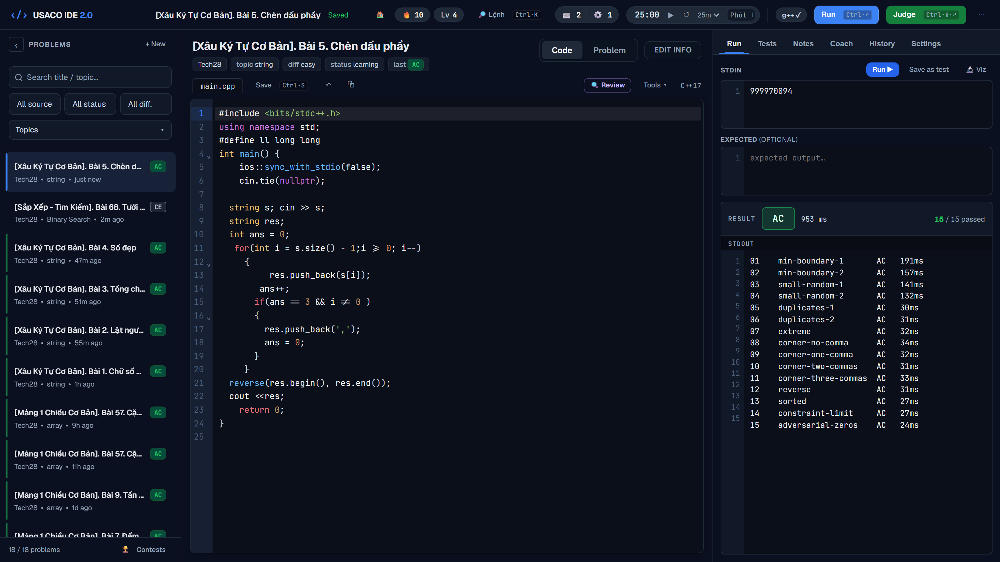
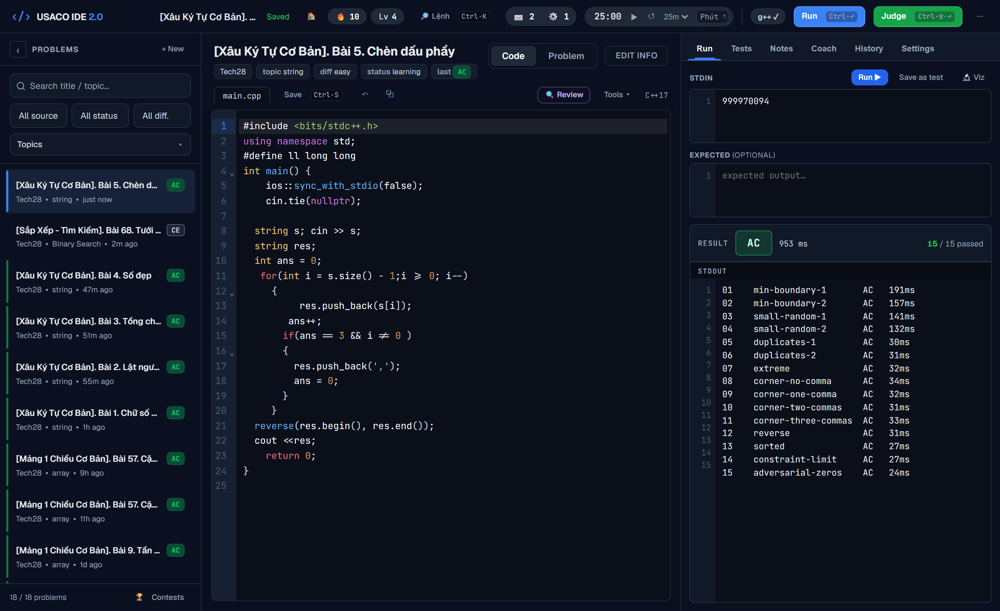
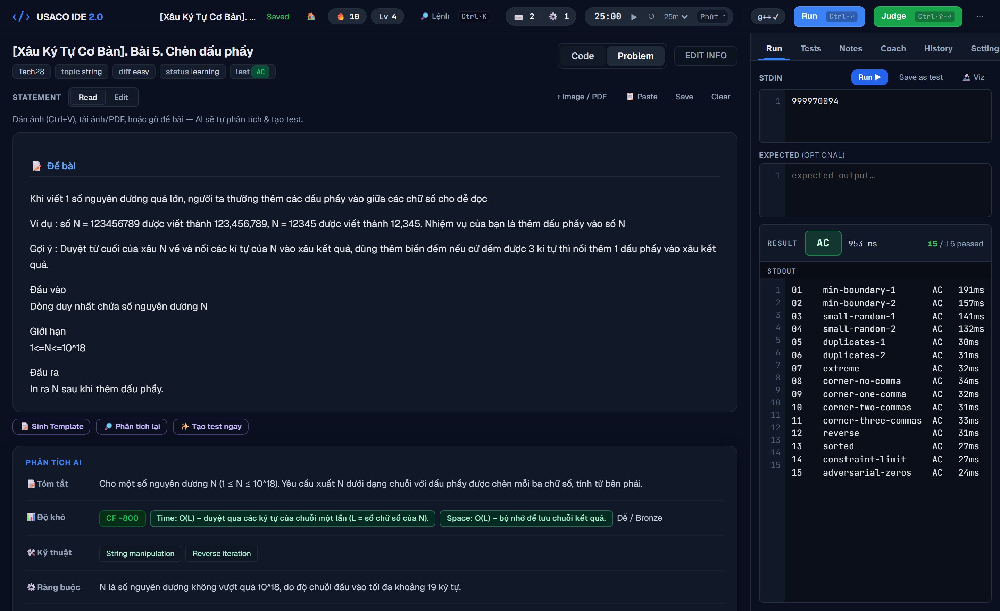
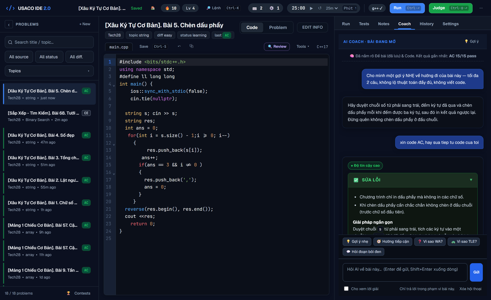
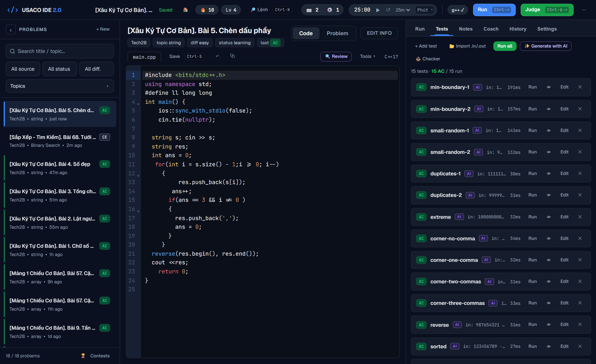
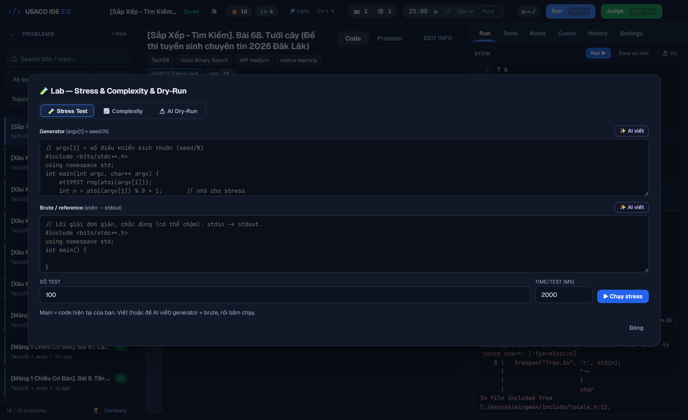
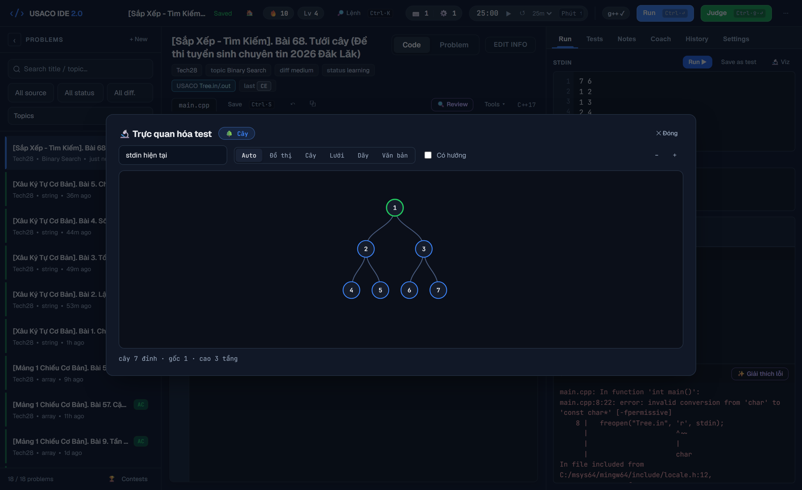

# USACO IDE 2.0

[](https://github.com/IwAnTtobEAneNgiNeEr/usaco-ide-2/actions/workflows/ci.yml)


A **local-first C++ IDE and judge** for competitive programming. Write C++, store one
file-set per problem on disk, run against your own input, and judge against many test
cases with a real local `g++` — plus a **stress-test Lab**, an **input Visualizer**, and
an optional **AI Coach**. No account, no cloud, no telemetry: it runs entirely on your
machine and works fully offline (AI features are the only thing that need the internet).

> The interface is primarily in **Vietnamese** (the project's home audience). The judge,
> Lab, Visualizer, and editor are language-agnostic and easy to use regardless.

---

## Why it exists

Most online judges make you upload code and wait. USACO IDE 2.0 keeps the whole loop
local and fast:

- **Real compiler, real verdicts** — `g++` compile + run with AC / WA / CE / RE / TLE,
  runtime metrics, and a side-by-side diff on Wrong Answer.
- **Your data is just files.** Every problem is a plain folder (`main.cpp`, `tests/`,
  `meta.json`, …) you can back up, diff, or edit by hand. Nothing is locked in a database.
- **Fast re-runs.** Compile caching + precompiled headers make repeat judges ~9× faster.
- **Offline.** CodeMirror and the fonts are vendored locally.

---

## Headline features

- **🧪 Stress Lab** — auto-write (or hand-write) a test *generator* and a *brute-force*
  reference, then hammer your solution with thousands of random cases until one disagrees.
  The fastest way to catch the hidden boundary bug that an online judge would WA you on.
- **🔬 Input Visualizer** — paste a test and the app detects its shape (graph, tree, grid,
  matrix, array) and draws it as an interactive SVG, with a whitespace inspector for
  presentation errors.
- **🤖 AI Coach** — an optional side-panel chat that already knows the open problem, your
  code, and your last verdict. Ask for a non-spoiler hint (*nudge → technique → approach*),
  "why is this WA?", or highlight code and press `Ctrl+Shift+E` to ask about a selection.
- **⚖️ Judge console** — verdict chips, runtime, line-numbered stdin/stdout/expected,
  Output / Compile / Diff tabs, loose/strict/token/float comparison, per-problem special
  judges (`checker.cpp`), and a live **⏹ Stop** button.
- **📥 Problem import** — type/paste a statement, **paste a screenshot** (local OCR), or
  upload a **PDF/DOCX** (MarkItDown). With an AI key, it can also analyze the statement and
  suggest test cases.
- **🏆 AI Contest Generator** — once you've solved enough of a topic, generate a brand-new
  practice contest on it (separate from your problem list).
- **📕 Mistake Notebook** — when you keep getting WA, the AI diagnoses the *thinking* error
  (never rewrites your code) and records the lesson to `mistakes.md`.
- **🗺️ Skill map & 📊 Dashboard** — track mastery per topic and a spaced-review queue.
- **🎓 Explain Your Solution** — after an AC, the AI asks you 3 questions about your own
  code so you can check you actually understand *why* it works.
- **Editor** — CodeMirror 6: syntax highlight, auto-pairs, auto-indent, block Tab, and Tab
  snippets (`fastio`, `fori`, `rep`, `vi`, `pii`, `ll`, `sortv`, `yes`, `no`, `main`, …).
- **🏠 Journey (optional)** — a streak/XP/quests home screen if you like gamified practice;
  it's one click away via the 🏠 chip but the app **starts you in the editor**, not a
  dashboard.

> Full per-topic guides live in [`docs/`](docs). Start with
> **[docs/GettingStarted.md](docs/GettingStarted.md)**.

---

## Screenshots



| Editor + Judge console | Problem statement | AI Coach |
|:--:|:--:|:--:|
|  |  |  |

| Test suite | Stress Lab | Input Visualizer |
|:--:|:--:|:--:|
|  |  |  |

---

## Requirements

| Need | For | Notes |
|------|-----|-------|
| **Node.js ≥ 18** | the app itself | https://nodejs.org |
| **A C++ compiler (`g++`)** | compiling & judging | Windows: MinGW-w64 ([winlibs.com](https://winlibs.com) or MSYS2). macOS: `xcode-select --install` or `brew install gcc`. Linux: `sudo apt install g++`. Make sure `g++ --version` works, or set the full path in **Settings → Compiler**. |
| **Python + Tesseract** *(optional)* | pasting/uploading **image** statements (local OCR) | `pip install pytesseract pillow` and install the Tesseract engine (Windows: `winget install UB-Mannheim.TesseractOCR`; for Vietnamese accents also install the `vie` language data). |
| **MarkItDown** *(optional)* | importing **PDF/DOCX** statements | `pip install markitdown[all]` |
| **An OpenAI-compatible API key** *(optional)* | all AI features | Entered in **Settings → AI**, stored only in `data/ai-settings.json` (gitignored). |

Everything except Node and `g++` is optional — the IDE, Lab, Visualizer, and judge work
with no Python and no API key.

---

## Quick start

```bash
git clone https://github.com/IwAnTtobEAneNgiNeEr/usaco-ide-2.git
cd usaco-ide-2
```

### Windows
Double-click **`launcher/start-usaco-ide.bat`** (or run `launcher/start-usaco-ide.ps1`).
It checks Node ≥ 18, runs `npm install` on first launch, starts the backend, and opens
`http://127.0.0.1:5050`.

### macOS / Linux
```bash
bash launcher/start-usaco-ide.sh
```

### Manual (any OS)
```bash
npm run setup   # installs backend deps (first time only)
npm start       # then open http://127.0.0.1:5050
```

On first run with an empty workspace the app **seeds a sample problem**
(*Tổng hai số · Sum of Two Numbers*, with a working solution and 3 tests) so you can press
**Run** and **Judge All** immediately to verify your compiler. Delete it whenever you like.

### Desktop app (optional, experimental)
A thin Electron wrapper lives in [`desktop/`](desktop) — it runs the same backend in a
native window. See [`desktop/README.md`](desktop/README.md). Packaging to an installer
(`npm run dist`) is experimental.

---

## Using the app

Three columns:

- **Left — Problems:** search, filter by source/status/difficulty, create, duplicate,
  delete; each row shows the last verdict + last-edited time.
- **Middle — Editor / Problem:** the C++ editor (autosave) with a **Problem** view for the
  statement, analysis, and examples. Post-AC tools (🎓 Explain, 📈 Harder variant) appear
  in the toolbar once a problem is solved.
- **Right — Console:** **Run**, **Tests**, **Notes**, **Coach**, **History**, **Settings**.

### Key shortcuts
| Action | Keys |
|---|---|
| Command palette | `Ctrl + K` |
| Run | `Ctrl + Enter` |
| Judge all | `Ctrl + Shift + Enter` |
| Save | `Ctrl + S` |
| New problem | `Ctrl + N` |
| Ask AI Coach | `Ctrl + ;` |
| Ask about selection | `Ctrl + Shift + E` |
| Toggle Explorer | `Ctrl + B` |
| Zen focus | `Alt + Z` |
| All shortcuts | `?` |

Full list: [docs/Shortcuts.md](docs/Shortcuts.md).

### Verdicts
| | Meaning |
|---|---|
| **AC** | Accepted — output matches expected |
| **WA** | Wrong Answer |
| **CE** | Compile Error |
| **RE** | Runtime Error (non-zero exit / crash) |
| **TLE** | Time Limit Exceeded |

Output comparison ignores trailing spaces and the final newline by default (**loose**);
switch to **strict** / **token** / **float** in Settings. (MLE is reserved/colored but not
enforced — see [docs/LocalJudge.md](docs/LocalJudge.md).)

---

## AI setup (optional)

USACO IDE 2.0 works with any **OpenAI-compatible** Chat Completions API.

1. **Settings → AI** → paste your **API key** (click **Detect** and it fills the provider /
   base URL / model for you), or set them by hand. **Save**, then **Test connection**.
2. Your key is stored only in `data/ai-settings.json` (gitignored, never logged). The UI
   only ever reports *whether* a key is set.
3. Set one or more **Fallback models** (comma-separated) and a rate-limited model rolls
   over automatically.

Without a key, every AI action gives a friendly *"add an API key in Settings"* message —
never a crash. Full guide: [docs/AIConfiguration.md](docs/AIConfiguration.md).

> ⚠ **AI can be wrong about expected outputs.** Generated tests it isn't sure about are
> marked *NO EXPECTED* (input-only). Always review AI tests and re-run a known-good
> solution before trusting them.

---

## Configuration files

| File | Committed? | Purpose |
|------|------------|---------|
| `data/settings.example.json` | ✅ | template — compiler path, limits, compare mode |
| `data/ai-settings.example.json` | ✅ | template — AI provider, base URL, model |
| `.env.example` | ✅ | optional ports/host overrides (**not** the API key) |
| `data/settings.json` | ❌ gitignored | your app settings (auto-created on first run) |
| `data/ai-settings.json` | ❌ gitignored | **your real API key — never commit this** |
| `data/template.cpp` | ❌ gitignored | your personal C++ starter (Settings → Code template) |
| `workspace/` | ❌ gitignored | your problems, contests, run history, compile cache |

The app creates the real files itself; the `.example` files only document the format.

### Environment variables (all optional)
`USACO_IDE_PORT` (default 5050) · `USACO_IDE_HOST` (default 127.0.0.1) ·
`USACO_COMPANION_PORT` (default 10043; `0` disables). See `.env.example`.

---

## Project structure

```
usaco-ide-2/
  launcher/            # start scripts: .bat / .ps1 (Windows), .sh (macOS/Linux)
  desktop/             # optional Electron wrapper (experimental)
  backend/             # Node.js + Express API + g++ judge
    server.js
    src/
      config.js        # paths, defaults, limits
      runCpp.js        # compile / run / compare
      judgeService.js  # parallel judge pool, SPJ, cancellation
      problemStore.js  # problem folders, meta.json, tests, history
      contestStore.js  # AI contest domain (workspace/contests/)
      ai.js            # OpenAI-compatible client (chat, tests, analysis, …)
      ocr.js           # LOCAL image OCR via Tesseract
      markitdown.js    # PDF/DOCX -> Markdown via MarkItDown
      progress.js      # derived XP/streak/quests (no stored state)
      routes/          # problems, files, judge, ai, contests, settings, …
  frontend/            # vanilla ES-module UI (no build step)
    index.html
    src/               # main, editor, runner, statement, features/*
    styles/            # main, theme, polish, journey, features
    vendor/            # CodeMirror 6 + fonts (offline)
  workspace/           # YOUR problems/contests/history (gitignored)
  data/                # settings + AI key (real files gitignored; *.example committed)
```

A short backend API reference lives in [docs/LocalJudge.md](docs/LocalJudge.md) and
[docs/AIConfiguration.md](docs/AIConfiguration.md).

---

## Engineering notes

- **Backend** — Node.js + Express, a *single* runtime dependency. File-per-problem storage,
  no database. Atomic writes (temp + rename) and per-problem write locks so a verdict is
  never lost to a crash or a race.
- **Judge** — real `g++`, compile cache + PCH, a bounded parallel pool with serial TLE
  re-confirmation (so verdicts stay trustworthy under load), loose/strict/token/float
  comparison, and per-problem special judges.
- **Security** — binds to `127.0.0.1` and enforces a loopback `Host` header (DNS-rebinding
  guard), because it compiles and runs arbitrary C++. **Never expose it to the internet.**
- **AI layer** — optional, OpenAI-compatible, disk-cached, cancellable, with model fallback
  + backoff and friendly error messages. Fully usable with no key.
- **Frontend** — vanilla ES modules, no framework, no build step. Styles load in a
  documented cascade (tokens/grid → features → theme → polish → responsive → elevation →
  identity; see the comment in `frontend/index.html`). The order is intentional; folding
  these layers into a single `tokens/layout/components` set is a tracked cleanup, not an
  accident of growth.
- **Tests** — backend unit tests via `node --test` (zero test deps) cover the grader, judge
  pool + SPJ, progress engine, skill map, AI prompt contracts, and first-run seeding. CI
  runs them on Ubuntu + Windows across Node 18 / 20 / 22.

---

## Running tests

```bash
npm test          # from the repo root (proxies to backend)
```

## Contributing

Issues and PRs welcome — see [CONTRIBUTING.md](CONTRIBUTING.md). Keep the spirit of the
project: local-first, zero build step, no heavyweight dependencies. Run `npm test` first.
Roadmap: [ROADMAP.md](ROADMAP.md) · Changes: [CHANGELOG.md](CHANGELOG.md).

## License

[MIT](LICENSE) © 2026 Ho Thien Phuc
